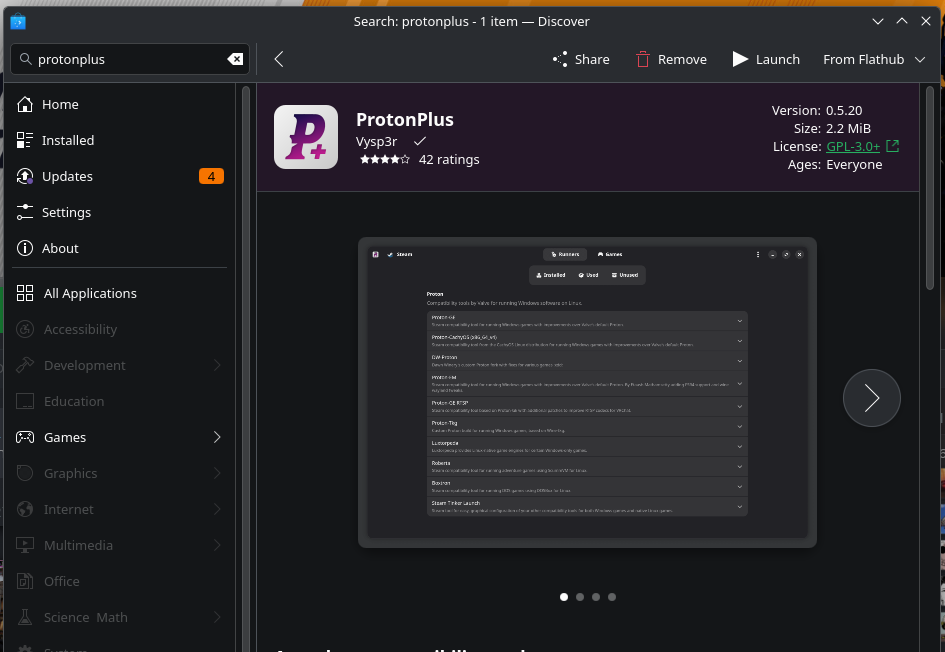
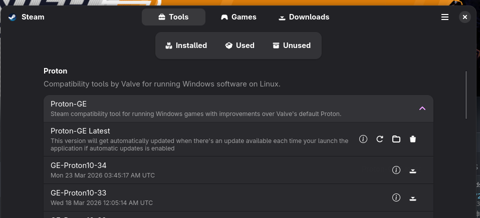
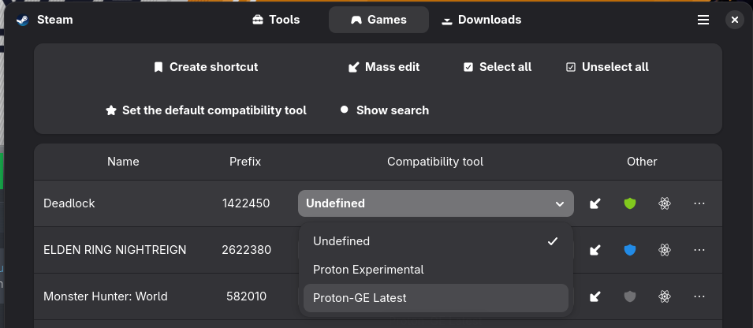

# Arc Raiders

- Cursor / Mouse not respecting window scope
- FPS drops / Graphical issues (recommended)

## On Wayland

### Cursor / Mouse

You must install the ProtonPlus application, it'll install to you a customized
version of the proton, you can install with flatpak (on the software store).

On the app, you'll need to install the Proton-GE latest version

Close your Steam client.

Still on ProtonPlus, select the *Games* tab on the top and set the
*Compatibility tool* to Proton-GE.

Open again you steam client and must be applied, if not, select in the
compatibility option on the game Properties.

### FPS drops / Graphical issues

Open the game properties

On the general properties, modify the launch options with the following command:

`PROTON_ENABLE_WAYLAND=1 PROTON_FSR4_RDNA3_UPGRADE=1 PROTON_USE_NTSYNC=1 PROTON_USE_EAC_LINUX=1 %command% -dx12 -useallavailablecores -nojoy`
