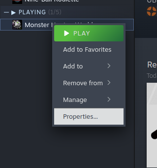
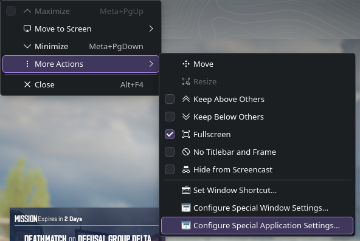
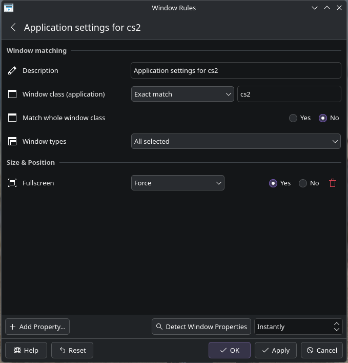

# Counter Strike 2

- Unable to use fullscreen
- Sound missing on matches

## On Wayland

Open the game properties

On the general properties, modify the launch options with the following command:

`SDL_AUDIO_DRIVER=pulse %command% -nojoy -sdlaudiodriver pulse`

1. SDL_AUDIO_DRIVER: Says explicitly to the game that you want to use pulseaudio.
2. sdlaudiodriver: Says explicitly to the game that you want to use pulseaudio.
3. nojoy: Says to the game to disable joystick controller support.

If you're using pipewire, you should need *pipewire-pulse*, you can install
it with your package manager.

if this don't work, you can try using the opposite:
`SDL_AUDIO_DRIVER=pipewire %command% -nojoy -sdlaudiodriver pipewire`

### KDE

To solve the fullscreen issue, you need to open the game on windowed mode and
right click on the window bar (or Alt + F3), and select the option
'Special Application Settings'.

On the settings, add a new property to force fullscreen on whe targeted window.

### Others

Applying windowed fullscreen on the game should already work, if not, try adding
the `-fullscreen` option on the game launch options, example:

`SDL_AUDIO_DRIVER=pulse %command% -nojoy -fullscreen -sdlaudiodriver pulse`
