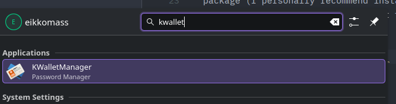
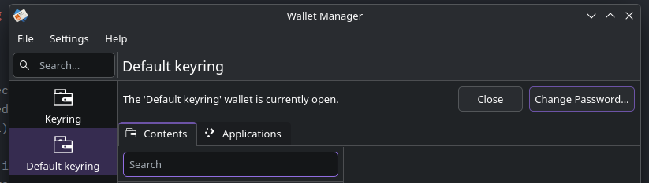

# Minecraft: Java Edition

- Installing
- Launcher not keeping login credentials

## Installing

You can install the Minecraft launcher from the
[official website](https://www.minecraft.net/en-us/download)
if you're using a debian based distribution or want to install it manually.

If you're using Arch Linux, you can install it from the [AUR](https://aur.archlinux.org/packages/minecraft-launcher).

## Launcher not keeping login credentials

### KDE

The reason should be because keyring credentials are not being saved properly.
On KDE this type of credentials are saved on your KWallet (probably the KDE asked
to set a password to it).

To solve this you must install the [kwalletmanager](https://archlinux.org/packages/extra/x86_64/kwalletmanager/) 
package (I personally recommend installing it with your package manager) and set
the password of your default wallet to empty, doing that your credentials will be
saved properly.

After installing the package, this application must be available:

On your **Default Keyring**, change your password to empty

Try to login again on the minecraft launcher and must be working now.
